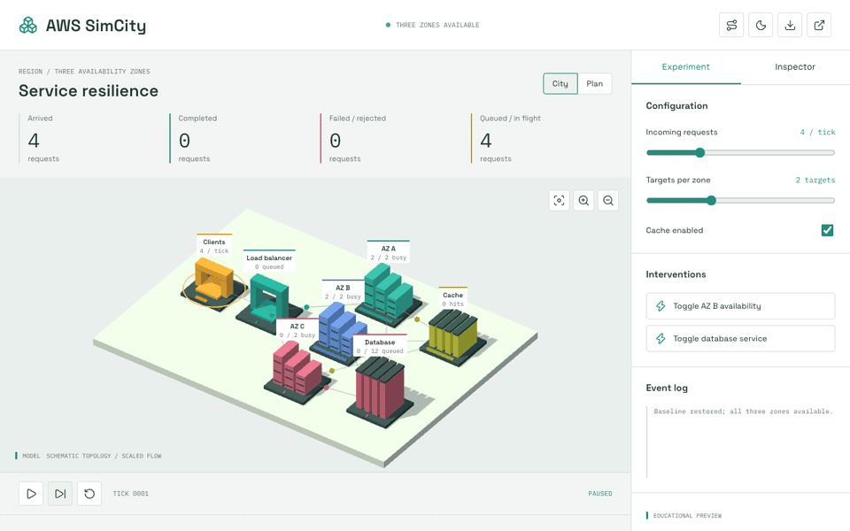

# AWS SimCity



A working 3D service-resilience experiment: three illustrative availability
zones, a bounded ingress queue, finite worker slots, a cache, and a database
bottleneck. Change arrival pressure, replica count, and cache use; interrupt a
zone or the database and inspect the resulting request accounting.

Local preview is available through the portfolio gallery or the commands below.
This repository remains private; public Pages deployment is not enabled.

Independent educational software, not affiliated with Amazon Web Services.
No AWS account, credentials, cloud resource, or network request is used by the
simulation. No cost, SLA, real failover, or hardware performance is estimated.

## Model And Sources

- [Model](src/sim/model.ts) owns all state; [renderer](src/world/city.ts) only
  reads it. [Tests](src/sim/model.test.ts) assert conservation on every tick:
  `arrived = completed + rejected + inFlight`.
- The model's ingress queue holds 24 requests; the database waiting queue holds
  12. Each target and the single database worker takes two model ticks. These
  are teaching choices, not service quotas or measured durations.
- The cache deterministically hits four of five request IDs when enabled.
  Zone B failure rejects its in-flight requests; requests in other components
  remain accounted for. Database interruption retains queued/processing work.
- [ALB overview](https://docs.aws.amazon.com/elasticloadbalancing/latest/application/introduction.html)
  supports the target-group and multi-zone context. The city's deterministic
  zone-order routing is not ALB's actual configurable routing algorithm.
- [Availability-zone boundaries](https://docs.aws.amazon.com/whitepapers/latest/aws-fault-isolation-boundaries/availability-zones.html),
  [ElastiCache](https://docs.aws.amazon.com/AmazonElastiCache/latest/dg/WhatIs.html),
  and [RDS Multi-AZ](https://docs.aws.amazon.com/AmazonRDS/latest/UserGuide/Concepts.MultiAZ.html)
  supply context, not simulation coefficients. Autoscaling, retries, health
  checks, database replication, authentication, and durability are omitted.

## Run And Verify

Node.js 24 is used in CI. All runtime assets, including fonts, are bundled locally.

```bash
npm ci
npm run dev -- --host 127.0.0.1
npm test
npm run typecheck
npx playwright install chromium
npm run test:browser
npm run build
```

The production browser suite uses a non-root Pages-style path. It checks desktop
and mobile City/Plan framing, canvas pixels and motion, labels/overflow, explicit
steps, pause/reset, configuration, interventions, keyboard inspection, guided
tour, JSON export, and a usable no-WebGL fallback. Reduced motion starts paused;
explicit stepping remains available. Reset retains configuration and clears time.

Exports identify `kind: illustrative-model`; they are snapshots, not imported
replays or captured AWS telemetry. CI runs audit, types, units, and browser tests
before deploying public `main`. Browser success does not verify native AWS
service behavior. The shared UI implementation is local to this repository;
there is no cross-repository runtime dependency.

## Next Work

Health-check delay, retry budgets, cache keys, and a causal autoscaling policy
need separate model fixtures before being presented as supported behavior.